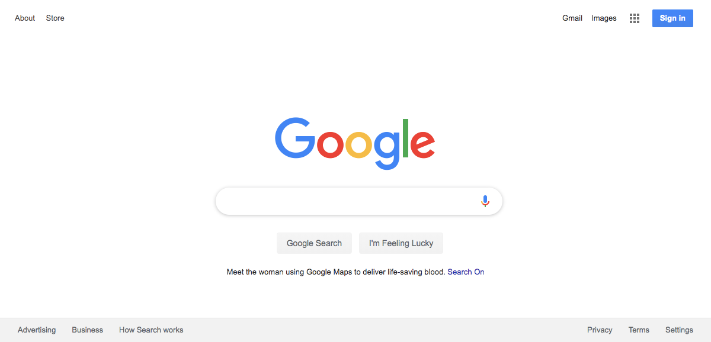
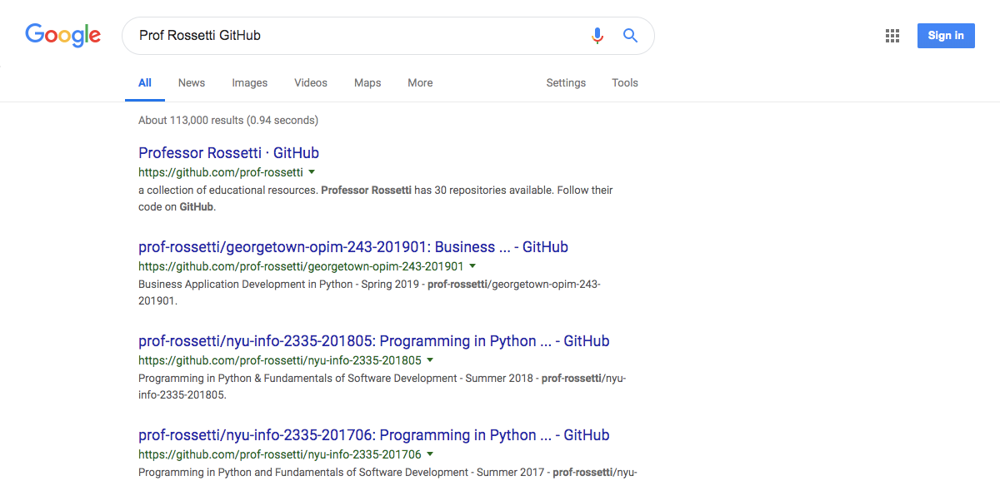

# The `selenium` Package

The `selenium` package provides capabilities for automating the process of browsing the web and interacting with elements on any web page.

Reference:

  + [Source Code](https://github.com/SeleniumHQ/selenium/tree/master/py)
  + [Official Docs](https://seleniumhq.github.io/selenium/docs/api/py/api.html)
  + [Unofficial Docs](https://selenium-python.readthedocs.io/index.html)

## Prerequisites

Before proceeding, we need to install a special kind of web browser called a "web driver" which the Selenium package will be able to control.

There are options to use a Firefox-based browser, but the professor recommends you [install the Google Chrome-based "Chromedriver"](./../../clis/chromedriver.md#installation). Identify the path to where you have installed `chromedriver`. We'll need this value later (see `CHROMEDRIVER_PATH` variable below in the "Usage" example).

## Installation

After installing a web driver, install the package using Pip, as necessary:

```sh
pip install selenium
```

## Usage

First, initialize a new driver object. You can do so in the default mode, which will open a browser window for you to view, or in "headless" mode, which will not open a browser window.

```py
from selenium import webdriver
from selenium.webdriver.common.keys import Keys

#
# INITIALIZE THE DRIVER
#

CHROMEDRIVER_PATH = "/usr/local/bin/chromedriver" # (or wherever yours is installed)

driver = webdriver.Chrome(CHROMEDRIVER_PATH)

# ... OR IN "HEADLESS MODE"...
# options = webdriver.ChromeOptions()
# options.add_argument('--incognito')
# options.add_argument('--headless')
# driver = webdriver.Chrome(CHROMEDRIVER_PATH, chrome_options=options)
```

After initializing a driver, use it to visit and interact with web pages:

```py
#
# NAVIGATE TO GOOGLE.COM...
#

driver.get("https://www.google.com/")
print(driver.title) #> Google
driver.save_screenshot("search_page.png")

#
# FIND AN ELEMENT TO INTERACT WITH...
# a reference to the HTML element:
# <input title="Search">

searchbox_xpath = '//input[@title="Search"]'
searchbox = driver.find_element_by_xpath(searchbox_xpath)

#
# INTERACT WITH THE ELEMENT
#

search_term = "Prof Rossetti GitHub"
searchbox.send_keys(search_term)

searchbox.send_keys(Keys.RETURN)
print(driver.title) #> 'Prof Rossetti GitHub - Google Search'
driver.save_screenshot("search_results.png")

#
# ALWAYS QUIT THE DRIVER
#

driver.quit()
```

Resulting screenshots:




