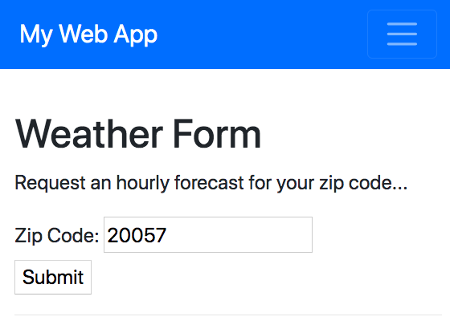

# "Web App" Exercise

## Prerequisites

 + ["Web Service" Exercise](/exercises/web-service/README.md)

## Learning Objectives

  + Create a basic web application in Python, using modular architecture.
  + Write routing logic to handle GET requests, and respond with HTML pages.
  + Write API routing logic to handle GET and/or POST requests, and respond with JSON data.
  + Gain exposure to HTML templates, and using HTML forms to submit form data.
  + Run a web application in "development" using a local web server.
  + Deploy a web application to a user-facing "production" environment (i.e. a Heroku server).

## References

  + [The `flask` Package](/notes/python/packages/flask.md)
  + [HTTP Requests and Responses](/notes/info-systems/networks.md#HyperText-Transfer-Protocol)
  + [Web Forms - W3Schools](https://www.w3schools.com/html/html_forms.asp)
  + [Web Forms - Mozilla](https://developer.mozilla.org/en-US/docs/Learn/Forms)
  + [Sending and Retrieving Form Data - Mozilla](https://developer.mozilla.org/en-US/docs/Learn/Forms/Sending_and_retrieving_form_data)

## Instructions

So, you've [deployed a background web service](/exercises/web-service/README.md) to send you an email every day. But what if you wanted the information on-demand at the click of a button, without waiting for the next daily email? And what if you wanted to allow other people to register for your service? Let's build a web application interface into your application's functionality!



Follow these written "checkpoints" sequentially for a guided walk-through:

  1. [Basic App](checkpoints/1-basic-app.md)
  2. [Application Factory](checkpoints/2-app-factory.md)
  3. [Rendering HTML Templates](checkpoints/3-render-template.md)
  4. [Shared Layouts](checkpoints/4-shared-layout.md)
  5. [Bootstrap Layouts](checkpoints/5-bootstrap-layout.md)
  6. [Web Forms](checkpoints/6-forms.md), POST Requests, and Flash Messaging
  7. [Integrating Weather Functionality](checkpoints/7-integration.md)

Also feel free to reference this [Draft Pull Request (2020)](https://github.com/prof-rossetti/daily-briefings-py/pull/4) which includes a [step-by-step commit history](https://github.com/prof-rossetti/daily-briefings-py/pull/4/commits) and [comprehensive file diffs](https://github.com/prof-rossetti/daily-briefings-py/pull/4/files).

### Setup

To use the Flask package, you'll need to add `Flask` to the "requirements.txt" file and re-install packages:

```sh
pip install -r requirements.txt
```

### Running Locally

Depending on the way a Flask app is organized, the run command will differ, but based on the provided organizational structure (with the `create_app()` function in the "web_app/\_\_init__.py" file), the following command should run web application locally so you can view it in a browser at localhost:5000:

```sh
# Mac:
FLASK_APP=web_app flask run

# Windows:
export FLASK_APP=web_app # first time, to set the env var
flask run # subsequent times
```

### Deploying to Production

After demonstrating the ability to successfully run the web app locally, repeat the process that you followed when [deploying a web service](/exercises/web-service/deploying.md) to upload the source code onto a remote server:

```sh
git push heroku main
```

There are no scripts to be scheduled, so skip that part. Instead, you'll need to create a special file called the "Procfile" in the repo's root directory to instruct the Heroku server which command to invoke in order to run the app:

```sh
web: gunicorn "web_app:create_app()"
```

> NOTE: since we're instructing the server to use the "gunicorn" package (Heroku's preferred tool) to run the web app on production, we'll also need to add `gunicorn` to the "requirements.txt" file so it will be installed on the server during the deployment process.

Save the "Procfile" and "requirements.txt" files, and make a commit before re-attempting to deploy your app to the server.

```sh
git push heroku main
```

View the server logs and troubleshoot as necessary until you're able to see the weather forecast in the browser. Nice!

```sh
heroku logs --tail
```
